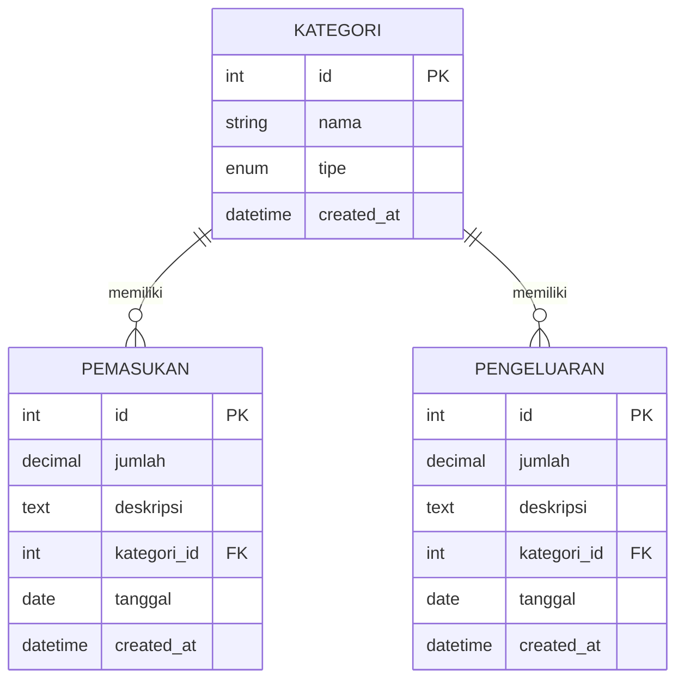

# Database Schema Dompetku

Skema database Dompetku terdiri dari tabel-tabel berikut yang dibuat melalui file migration di `src/database/migrations/`.

## Tabel `users`

Tabel untuk menyimpan data user/autentikasi.

| Kolom | Tipe | Nullable | Deskripsi |
|-------|------|----------|-----------|
| id | INT | No | Primary key, auto increment |
| username | VARCHAR(80) | No | Username unik untuk login |
| password_hash | VARCHAR(255) | No | Password yang sudah di-hash (bcrypt) |
| created_at | TIMESTAMP | No | Tanggal pembuatan akun |

## Tabel `kategori`

Tabel untuk menyimpan kategori transaksi.

- `id` INT, primary key, auto increment
- `nama` VARCHAR(100), wajib
- `tipe` ENUM(`pemasukan`, `pengeluaran`), wajib
- `created_at` TIMESTAMP, default current timestamp

## Tabel `users`

- `id` INT, primary key, auto increment
- `username` VARCHAR(80), wajib, unik
- `password_hash` VARCHAR(255), wajib
- `created_at` TIMESTAMP, default current timestamp

## Tabel `pemasukan`

- `id` INT, primary key, auto increment
- `jumlah` DECIMAL(15,2), wajib
- `deskripsi` TEXT, opsional
- `kategori_id` INT, foreign key ke `kategori.id`
- `tanggal` DATE, wajib
- `created_at` TIMESTAMP, default current timestamp

## Tabel `pengeluaran`

- `id` INT, primary key, auto increment
- `jumlah` DECIMAL(15,2), wajib
- `deskripsi` TEXT, opsional
- `kategori_id` INT, foreign key ke `kategori.id`
- `tanggal` DATE, wajib
- `created_at` TIMESTAMP, default current timestamp

## Relasi

- Satu `kategori` bisa punya banyak `pemasukan`
- Satu `kategori` bisa punya banyak `pengeluaran`

## ER Diagram (Ringkas)

