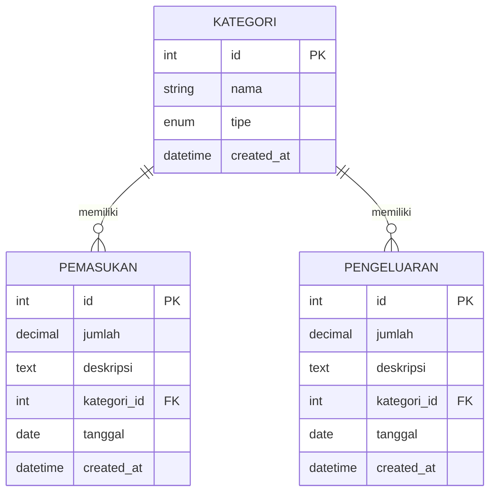

# Database Schema Dompetku

Skema database saat ini mengikuti file:
`src/database/migrations/001_create_tables.sql`.

## Tabel `kategori`

- `id` INT, primary key, auto increment
- `nama` VARCHAR(100), wajib
- `tipe` ENUM(`pemasukan`, `pengeluaran`), wajib
- `created_at` TIMESTAMP, default current timestamp

## Tabel `pemasukan`

- `id` INT, primary key, auto increment
- `jumlah` DECIMAL(15,2), wajib
- `deskripsi` TEXT, opsional
- `kategori_id` INT, foreign key ke `kategori.id`
- `tanggal` DATE, wajib
- `created_at` TIMESTAMP, default current timestamp

## Tabel `pengeluaran`

- `id` INT, primary key, auto increment
- `jumlah` DECIMAL(15,2), wajib
- `deskripsi` TEXT, opsional
- `kategori_id` INT, foreign key ke `kategori.id`
- `tanggal` DATE, wajib
- `created_at` TIMESTAMP, default current timestamp

## Relasi

- Satu `kategori` bisa punya banyak `pemasukan`
- Satu `kategori` bisa punya banyak `pengeluaran`

## ER Diagram (Ringkas)

