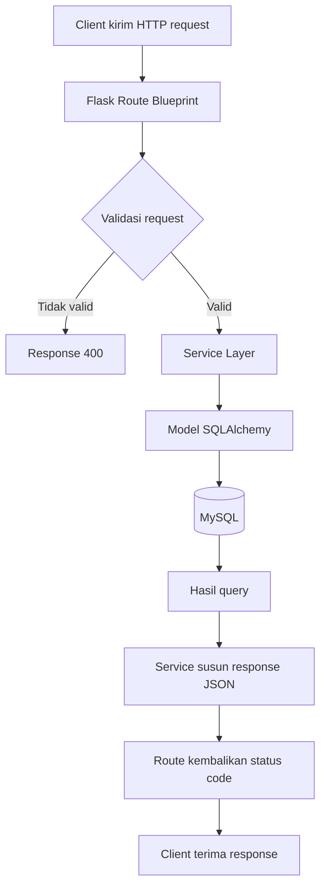

# Flowchart Arsitektur Request

Alur backend mengikuti pola `Route -> Service -> Model -> Database`.

## Blueprint Yang Terdaftar

- `/api/kategori`
- `/api/pemasukan`
- `/api/pengeluaran`
- `/api/saldo`
- `/api/rekap`
- `/api/statistik`

## Catatan

- Semua endpoint `/api/*` membutuhkan JWT (`@jwt_required()`).
- Endpoint root `/` hanya untuk health check.
