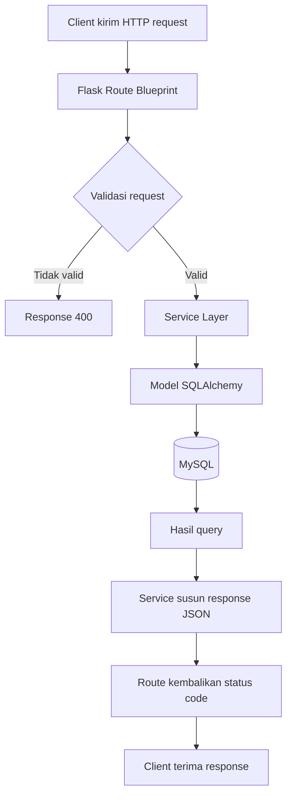

# Flowchart Arsitektur Request

Alur backend Dompetku mengikuti pola arsitektur berlapis: `Client -> Route -> Service -> Model -> Database`.

## Diagram Alur Request

## Blueprint Yang Terdaftar

Berikut adalah blueprint API yang terdaftar di aplikasi:

| Blueprint | URL Prefix | Deskripsi |
|----------|------------|-----------|
| auth_bp | /api/auth | Endpoint autentikasi (login/logout) |
| kategori_bp | /api/kategori | CRUD kategori transaksi |
| pemasukan_bp | /api/pemasukan | CRUD transaksi pemasukan |
| pengeluaran_bp | /api/pengeluaran | CRUD transaksi pengeluaran |
| rekap_bp | /api/rekap | Rekap keuangan bulanan |
| saldo_bp | /api/saldo | Perhitungan saldo |
| statistik_bp | /api/statistik | Statistik tahunan |

## Catatan

- Semua endpoint `/api/*` membutuhkan JWT (`@jwt_required()`) kecuali `/api/auth/login`.
- Endpoint root `/` hanya untuk health check.
- Format response adalah JSON untuk semua endpoint API.
